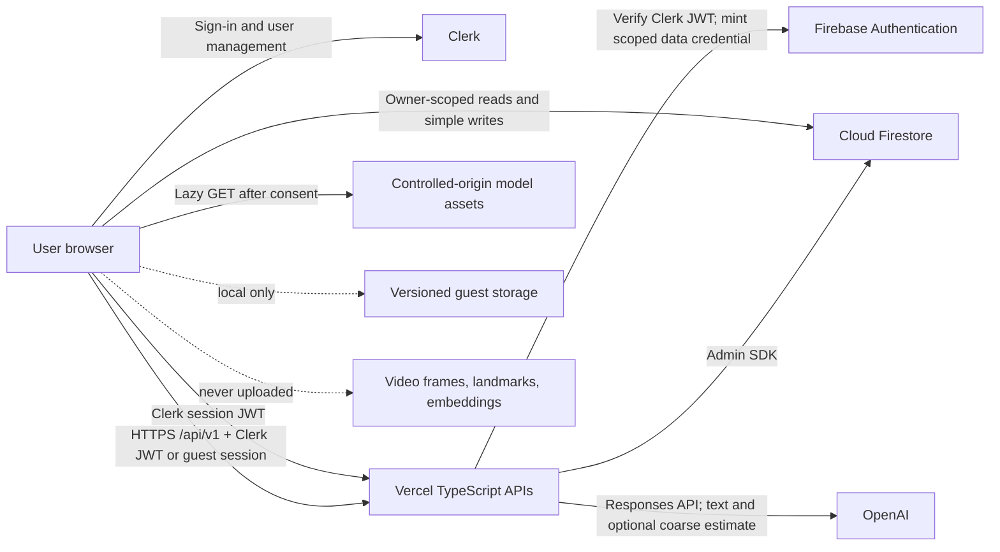

# Emotional Friend Chatbot Architecture

## Status and authority

This document fixes the rebuild architecture for the P0 MVP. Product behavior remains governed by `docs/EMOTIONAL_FRIEND_REBUILD_REQUIREMENTS.md`; the approved Claude Design system governs visual implementation. Any material architectural change requires an approved decision record and corresponding requirements update.

The target is one root Vite React TypeScript application, Clerk authentication and user management, Firestore persistence, Vercel TypeScript APIs, OpenAI Responses API, versioned browser-local guest storage, and controlled-origin lazy camera models.

## System context



Trust boundaries:

- The browser is untrusted. IDs, roles, history, ownership fields, limits, and status transitions supplied by it must be validated.
- Clerk establishes registered identity. A server-verified exchange mints a Firebase custom token with the same Clerk user ID solely for Firestore rule enforcement.
- Vercel functions are the only holder of OpenAI and Firebase Admin credentials.
- OpenAI receives the current text, bounded authorized context, and only consented coarse expression metadata. It never receives frames or raw Firebase identity.
- Guest conversations remain in browser storage. A signed guest API session supplies an abuse/idempotency principal but is not a server-side conversation store.
- Camera frames, landmarks, embeddings, biometric templates, and screenshots never leave the browser or persist.

## Runtime components

### Vite React TypeScript client

The client owns:

- Clerk auth-state restoration, prebuilt sign-in/sign-up controls, and account management.
- Registered chat list/message subscriptions or incremental reads constrained to the signed-in user's path.
- Guest-session lifecycle, version migration, size validation, corruption handling, and inactivity expiry.
- Optimistic message presentation and reconciliation by `clientRequestId`.
- Responsive application shell and accessible component states.
- Explicit camera consent, lazy model loading, inference scheduling, normalization, and complete teardown.
- Redacted frontend telemetry containing release version and error category only.

The client never owns authoritative authorization, safety policy, prompt construction, provider credentials, or registered-chat history selection for AI requests.

### Clerk authentication and Firebase data credentials

Clerk owns email/password, Google sign-in, sessions, and user management. The client waits for Clerk before requesting protected data. Vercel APIs verify Clerk session JWTs against the configured PEM public key and approved origin. The `/api/v1/data-session` exchange mints a Firebase custom token whose UID is the verified Clerk user ID; this credential exists only to preserve owner-scoped Firestore rules. IDs from request bodies never determine ownership.

### Cloud Firestore

Firestore stores registered profiles, chats, and messages:

```text
users/{uid}
users/{uid}/chats/{chatId}
users/{uid}/chats/{chatId}/messages/{messageId}
```

Direct client access is limited to the authenticated user's path. The Vercel API uses Firebase Admin only after explicitly comparing the verified principal with the requested path. Admin SDK access bypasses rules, so this application-layer check is mandatory.

### Vercel TypeScript APIs

Functions own:

- Clerk session-JWT and signed guest-session verification.
- Request/schema/content-type/body/origin/rate/concurrency validation.
- Principal-scoped idempotency and correlation IDs.
- Registered chat ownership checks and server-side context loading.
- Guest history validation and bounding.
- Safety routing and reviewed system-prompt construction.
- OpenAI Responses API calls, timeout/cancellation, one eligible transient retry, and stable error mapping.
- Atomic or recoverable registered-message persistence.
- Trusted, paginated chat cascade deletion.
- Redacted operational metrics and health/readiness responses.

Provider-specific OpenAI code must implement an application service interface so model/provider mechanics do not leak into UI or domain state.

### Local development topology

Local development uses three independent processes: Firebase emulators, the Vercel API runtime, and the root Vite development server. The browser opens the Vite origin. Vite proxies `/api/*` to the separate Vercel process; Vercel does not own or launch the local Vite process in this topology. Browser requests remain on the same-origin `/api` contract through that proxy.

This separation is intentional: Vite owns HMR and frontend assets, while Vercel owns TypeScript function routing and server-only environment variables. Local CORS/origin policy explicitly allows the Vite origin. Production serves the client and `/api` from the approved Vercel deployment origin.

### Camera model assets

Expression models are immutable, version-pinned artifacts under the application's controlled origin or an integrity-verified controlled host. The model manifest records version, file hashes, license/provenance, review result, and release date. Assets are lazy-loaded after explicit camera intent; loading must not request camera permission by itself.

## Domain contracts

### Canonical enums

```ts
type ExpressionLabel =
  | "angry"
  | "disgusted"
  | "fearful"
  | "happy"
  | "neutral"
  | "sad"
  | "surprised"
  | "unavailable";

type ConfidenceBand = "low" | "medium" | "high";
type MessageRole = "user" | "assistant" | "system";
type MessageStatus = "pending" | "complete" | "failed" | "deleted";
type TitleSource = "default" | "generated" | "user";
```

Provider-specific expression names must normalize into this enum before display, storage, or API submission. Unknown labels become `unavailable`.

### Registered records

```ts
interface UserRecord {
  uid: string;
  displayName: string | null;
  createdAt: ServerTimestamp;
  settings: {
    useEmotionContext: boolean;
    quotesVisible: boolean;
    locale: string;
  };
  consent: {
    cameraNoticeVersion: string | null;
    cameraNoticeAcceptedAt: Timestamp | null;
  };
}

interface ChatRecord {
  id: string;
  ownerUid: string;
  title: string;
  titleSource: TitleSource;
  createdAt: ServerTimestamp;
  updatedAt: ServerTimestamp;
  lastMessageAt: ServerTimestamp | null;
  quoteId: string | null;
  quoteSnapshot: object | null;
}

interface MessageRecord {
  id: string;
  chatId: string;
  ownerUid: string;
  role: MessageRole;
  text: string;
  status: MessageStatus;
  clientRequestId: string;
  createdAt: ServerTimestamp;
  completedAt: ServerTimestamp | null;
  emotionContext: {
    label: ExpressionLabel;
    confidenceBand: ConfidenceBand | null;
    modelVersion: string | null;
    observedAt: Timestamp | null;
  };
  generationMetadata: {
    provider: string | null;
    model: string | null;
    promptVersion: string | null;
  };
}
```

Rules and server code must validate allowed fields and transitions. Persisted ordering uses server timestamps. `ownerUid` is denormalized for defense/diagnostics only and is always set or verified against the authenticated path by trusted code.

For individual deletion, the recommended P0 representation is a tombstone: set `status="deleted"`, remove message text and optional emotion metadata, and preserve only identifiers/role/timestamps required for ordering and idempotency. Existing assistant text is not regenerated or rewritten. If legal/privacy review requires physical removal, the UI may synthesize the deleted placeholder locally after deletion.

Quote fields remain `null` in P0. Generated titles are P1; P0 starts with a deterministic default until the user renames the chat.

### Guest storage

The browser store is a single versioned, size-checked object:

```ts
interface GuestStore {
  schemaVersion: string | number;
  guestId: string;
  createdAt: string | number;       // ISO 8601 or epoch milliseconds
  lastActivityAt: string | number;
  chats: Array<{
    id: string;
    title: string;
    createdAt: string | number;
    updatedAt: string | number;
    messages: Array<{
      id: string;
      role: MessageRole;
      text: string;
      status: MessageStatus;
      clientRequestId?: string;
      createdAt: string | number;
    }>;
  }>;
}
```

Additional fields require a schema-version increment and migration. Firestore `Timestamp` objects are forbidden. Unsupported, malformed, missing, or oversized stores fail closed: stop camera, clear guest state, and return to a safe welcome screen. Storage quota errors leave the current in-memory conversation visible and show that it may not survive reload.

The inactivity duration is exactly 30 minutes. Creating/selecting/renaming/deleting a chat, sending/deleting a message, and explicit camera control update `lastActivityAt`; passive model loading/inference does not. Expiry is checked on load, qualifying activity, a bounded foreground timer, and return from page suspension. Expiry never touches registered data.

## API contracts

### Common protocol

- Production uses HTTPS and exact approved-origin CORS.
- JSON endpoints require `Content-Type: application/json` and enforce an approved body-size limit.
- Registered requests use `Authorization: Bearer <Clerk session JWT>`.
- Guest API calls use `Authorization: Bearer <signed guest token>`, where the token is issued for the browser store's UUID `guestId` by the guest-session endpoint.
- Every mutating browser endpoint requires a present, non-opaque `Origin` that exactly matches `ALLOWED_ORIGINS`; bearer authentication does not relax this gate.
- Every response includes `requestId` in the body where applicable and `X-Request-ID` in the header.
- `Idempotency-Key` is a client-generated UUID for mutating operations that can be retried.
- Logs never contain authorization headers/tokens, request bodies, response text, email, raw UID, or raw guest ID.

### Health/readiness

```http
GET /api/v1/health              # readiness by default
GET /api/v1/health?mode=ready   # explicit readiness
GET /api/v1/health?mode=live    # liveness only
```

Ready success is `200` with no secrets or dependency credentials:

```json
{
  "requestId": "00000000-0000-4000-8000-000000000000",
  "status": "ready",
  "service": "emotional-friend-api",
  "releaseVersion": "<immutable-release>",
  "timestamp": "2026-08-08T12:00:00.000Z"
}
```

Readiness validates required configuration and its Firestore dependency and returns `503` when unavailable; it does not make a paid OpenAI request. Liveness skips dependency/config readiness and returns the same coarse shape with `status="alive"`.

### Guest API session

```http
POST /api/v1/guest-sessions
Origin: <exact ALLOWED_ORIGINS match>
Content-Type: application/json
```

```json
{
  "guestId": "123e4567-e89b-42d3-a456-426614174000"
}
```

`guestId` must be a UUID and must match the ID in the active versioned browser guest store. The server validates the exact request origin and bounded JSON body, signs that principal, and returns `201`:

```json
{
  "requestId": "req_...",
  "token": "<signed-guest-token>",
  "guestId": "123e4567-e89b-42d3-a456-426614174000",
  "expiresAt": "2026-08-08T12:30:00.000Z"
}
```

This endpoint stores no chats or messages. Its expiry protects API access and does not replace the browser's authoritative inactivity calculation. A valid local session may request a new signed token when needed. Guest operational records contain only fingerprints/state/non-sensitive IDs/timestamps/expiry; completed replay that cannot be reconstructed without storing conversation text returns a stable non-provider-reinvoked error.

### Bounded client diagnostics

```http
POST /api/v1/client-events
Origin: <exact ALLOWED_ORIGINS match>
Content-Type: application/json
```

```json
{
  "releaseVersion": "<bounded-release-identifier>",
  "category": "client_error"
}
```

`category` is exactly `client_error`, `unhandled_rejection`, `storage_failure`, or `network_failure`. The endpoint is unauthenticated, exact-origin gated, body-size validated, and durably IP-rate-limited. It accepts no arbitrary detail or identity and returns `202` with `{requestId, accepted: true}`. Exception text, message content, camera data, and raw identity are never sent.

### Generate and persist a message

```http
POST /api/v1/chats/{chatId}/messages
Authorization: Bearer <Clerk session JWT>   # registered
Idempotency-Key: <UUID>
Content-Type: application/json
```

Registered request:

```json
{
  "text": "I had a difficult day.",
  "emotionContext": {
    "label": "sad",
    "confidenceBand": "medium",
    "modelVersion": "face-expression-v1",
    "observedAt": "2026-08-08T12:00:00.000Z"
  }
}
```

For registered users, the server rejects client-supplied `history`, verifies ownership of `chatId`, and loads bounded completed history itself.

Guest requests use the same endpoint and signed guest session. Because no guest conversation exists on the server, they may add:

```json
{
  "text": "I had a difficult day.",
  "emotionContext": null,
  "recentHistory": [
    { "role": "user", "text": "Earlier message" },
    { "role": "assistant", "text": "Earlier reply" }
  ]
}
```

Guest requests include `Authorization: Bearer <signed guest token>`. Guest history permits only completed `user` and `assistant` entries, excludes the current message, and is limited by the configured history count and request-body limit. It is untrusted content, never instructions.

Initial success is `201`; replay of the same completed request may return `200`:

```json
{
  "requestId": "req_...",
  "userMessage": {
    "id": "msg_...",
    "status": "complete"
  },
  "assistantMessage": {
    "id": "msg_...",
    "text": "That sounds exhausting. What part of the day weighed on you most?",
    "status": "complete",
    "variant": "assistant"
  }
}
```

`assistantMessage.variant` is exactly `assistant` or `safety_support`. A safety-support response also includes the strict reviewed metadata object `safety`; normal assistant responses must not include it.

Streaming is not required for the baseline contract. If enabled, the persisted terminal state and retry response must be equivalent to the non-streaming response.

### Delete a registered chat

```http
DELETE /api/v1/chats/{chatId}
Authorization: Bearer <Clerk session JWT>
Idempotency-Key: <UUID>
```

The server verifies ownership and starts or resumes paginated deletion. A large deletion returns `202`:

```json
{
  "requestId": "req_...",
  "operationId": "delete_...",
  "status": "pending"
}
```

The trusted operation deletes child messages in bounded pages, records retry/completion state, and deletes the chat only after child deletion completes. Small and replayed completed operations may return `200` with `status="complete"`. The UI shows progress/retry and does not claim deletion succeeded before terminal completion.

### Error envelope

All errors use:

```json
{
  "requestId": "req_...",
  "error": {
    "code": "AI_TEMPORARILY_UNAVAILABLE",
    "message": "The reply could not be generated right now.",
    "retryable": true
  }
}
```

Stable categories are:

| Category | Typical status | Retryable |
|---|---:|---:|
| `INVALID_REQUEST` | 400 | No |
| `UNAUTHENTICATED` | 401 | No; reauthenticate |
| `UNAUTHORIZED` | 403 | No |
| `CHAT_NOT_FOUND` | 404 | No |
| `IDEMPOTENCY_CONFLICT` | 409 | No |
| `REQUEST_IN_PROGRESS` | 409 | Yes, after backoff |
| `IDEMPOTENCY_REPLAY_UNAVAILABLE` | 409 | No; send a new message if desired |
| `RATE_LIMITED` | 429 | Yes, after backoff |
| `REQUEST_TOO_LARGE` | 413 | No |
| `UNSUPPORTED_MEDIA_TYPE` | 415 | No |
| `METHOD_NOT_ALLOWED` | 405 | No |
| `PROVIDER_TIMEOUT` | 504 | Yes |
| `AI_TEMPORARILY_UNAVAILABLE` | 503 | Yes |
| `SAFETY_INTERVENTION` | 422 | Depends on reviewed policy |
| `CONFIGURATION_ERROR` | 503 | No; operator action required |
| `INTERNAL_ERROR` | 500 | Usually yes |

Production errors never include stacks, Firestore paths, provider bodies, secret values, or existence-sensitive private details.

## Idempotency and message state

The idempotency record is keyed by an HMAC of principal, endpoint, and UUID, and contains a request fingerprint, lifecycle state, non-sensitive result reference, timestamps, and expiry. It does not contain raw text. A durable deployment-approved store is required; function-instance memory is prohibited.

Rules:

1. Same principal/key/fingerprint returns or reconciles the original operation.
2. Same principal/key with a different fingerprint returns `IDEMPOTENCY_CONFLICT`.
3. Registered sends use deterministic or transactionally reserved user/assistant message IDs. The API creates the user message plus pending assistant state before the provider call, then transitions the assistant to `complete` or `failed`.
4. Guest results are returned to and persisted by the browser. If an unknown outcome cannot be safely reconstructed without retaining guest conversation text, replay returns a stable retry-safe error rather than invoking the provider twice.
5. Eligible provider failures receive at most one automatic retry within the overall timeout/cancellation budget.

The browser may optimistically show `pending`, but server responses determine registered terminal state. A stale response is reconciled only into its original chat and never into the currently selected different chat.

## AI and safety pipeline

Processing order:

1. Verify principal, origin, rate/concurrency budget, schema, size, text length, and idempotency.
2. Authorize the chat and load registered history, or validate guest history.
3. Normalize/discard stale, unconsented, malformed, or unsupported expression metadata.
4. Run the documented text/context safety router. Camera metadata is never an input to crisis classification.
5. Construct the versioned system prompt. User text remains data, and prompt injection in history cannot change system policy.
6. Call the configured OpenAI model through the Responses API with timeout/cancellation and a pseudonymous safety identifier.
7. Validate the provider result, persist/reconcile registered status, and emit metadata-only metrics.

The prompt requires warm, specific acknowledgment before advice, non-clinical boundaries, purposeful questions, language matching when supported, and uncertainty around expression context. It forbids claims of consciousness, professional credentials, diagnosis, emotional certainty, monitoring, rescue, or guaranteed confidentiality.

Immediate-danger behavior uses independently reviewed wording. It encourages contacting local emergency services or a trusted nearby person now, remains concise, and never claims a human was alerted. Region-specific resources are selected only from reviewed records containing region, provenance, rights/status as relevant, review date, and dataset version. Unknown region receives location-neutral guidance and a region selector.

## Camera data flow

1. Camera is off by default; chat is fully usable.
2. First explicit use displays the versioned local-processing/uncertainty/no-upload notice.
3. After acceptance, request `video: true` and `audio: false`.
4. Lazy-load the pinned model manifest and assets from the implementation's controlled-origin model path.
5. Run only one inference at a time, no more frequently than every two seconds.
6. Apply the configured confidence threshold and consecutive-sample stability rule. Low-confidence/no-face output becomes `neutral` or `unavailable`, never a fabricated non-neutral label.
7. Display “Estimated expression” and keep a separate opt-in control for sending metadata to the reply API.
8. Stop every media track, animation/inference timer, and pending inference on Stop, sign-out, guest expiry, unmount, fatal error, and the approved page-visibility policy.

Only this consented object may enter the message request:

```ts
interface EmotionContextRequest {
  label: ExpressionLabel;
  confidenceBand: ConfidenceBand | null;
  modelVersion: string | null;
  observedAt: string | null; // ISO 8601
}
```

## Firestore security model

Rules must be deny-by-default. The required ownership invariant is equivalent to:

```text
match /users/{uid} {
  allow read, create, update, delete: if request.auth != null
                                      && request.auth.uid == uid;

  match /chats/{chatId} {
    allow read, create, update: if request.auth != null
                                && request.auth.uid == uid;

    match /messages/{messageId} {
      allow read: if request.auth != null && request.auth.uid == uid;
      // Client writes are restricted to explicitly approved fields/transitions.
      // Provider-generated fields and trusted cascade deletion are server-only.
    }
  }
}
```

The production rules must additionally validate types, title/text bounds, immutable identity fields, timestamps, roles, statuses, and allowed field transitions. They must prevent a client from creating an assistant/system message or generation metadata. Chat deletion is server-only to guarantee scalable cascading behavior.

Emulator tests must cover owner, non-owner, unauthenticated, malformed, client-forged `ownerUid`, forged assistant role/status, oversized title/text, foreign chat ID, and existence-sensitive denial behavior. Required compound indexes are version-controlled and deployed before dependent code.

## Security and privacy controls

- Server credentials exist only in Vercel environment variables and are never prefixed `VITE_`.
- CSP restricts scripts/connects/assets to approved origins; HSTS and `X-Content-Type-Options: nosniff` are enabled.
- Permissions Policy permits camera only where intended and disables microphone for the app.
- User/model/quote content renders as inert text; future Markdown requires sanitization tests.
- Rate limits apply per registered account or signed guest, plus a privacy-reviewed IP/abuse signal.
- Logs/analytics omit message bodies, camera/facial data, email, raw identities, secret headers, and provider bodies.
- Operational identities are purpose-limited HMAC values with rotatable secrets.
- Development, preview, and production use separate configuration and do not share production secrets.

## Performance and compatibility budgets

- P75 usable application: at most 3 seconds on representative mid-range mobile/4G, excluding optional first camera download.
- P95 typical chat-list load: at most 2 seconds.
- Visible accepted-send feedback: within 300 milliseconds.
- Camera sampling: at least two seconds between starts and never overlapping.
- Chat/message UI: paginated/incremental before DOM growth becomes unbounded.
- Supported at release review: latest two major Chrome, Edge, Firefox, and Safari versions, current iOS Safari, and current Android Chrome.
- Unsupported/insecure camera environments degrade to text-only chat.

## Migration and compatibility

Existing registered conversations are preserved by default. Migration maps `name` to `title`, `isChatbot` to `role`, and legacy `createdAt` to the target timestamp model. Missing optional values receive deterministic defaults.

Migration must be tested on a production-like copy, observable, resumable, and idempotent. A rollback or dual-read window is approved before mutation. Schema changes use expand/migrate/contract; do not remove legacy reads or components until parity evidence confirms the new path. The deployable application ends with one chat orchestration state module, one canonical API contract, and no image-upload/random-emotion endpoint.

## Explicitly deferred architecture

P0 does not include quote retrieval/persistence behavior, manual emotion correction, generated titles, chat search, guest-to-account migration, self-service export, or streaming/cancellation unless separately approved without weakening P0 gates. P2 voice, multimodal uploads, native apps, localization, social/payment systems, and cross-device guest storage have no reserved runtime architecture in this release.
